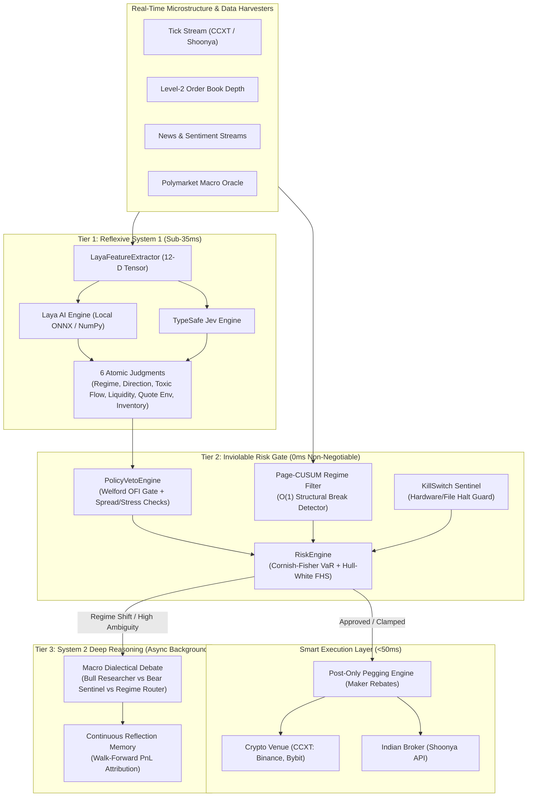

# ⚡ Godmode Quantitative Trading Engine (SOTA Institutional Edition)

[-089981?style=for-the-badge&logo=pytest)](file:///d:/Ai%20trader/tests)
[](file:///d:/Ai%20trader/src/godmode)
[](file:///d:/Ai%20trader/LICENSE)
[](file:///d:/Ai%20trader/pyproject.toml)

A mathematically rigorous, zero-bloat, **institutional-grade algorithmic trading system** designed for absolute correctness, structural survivability, and continuous self-improving execution across global crypto and equity derivatives.

> **Design Priority Hierarchy:**  
> **Mathematical Correctness → Tail-Risk Survivability → Microstructure Edge → Returns**

---

## 🏛️ System Architecture Overview

The system is architected as an **adversarial two-tier cognitive brain** paired with an **inviolable deterministic risk and execution gate**:



---

## 🧠 Core Quantitative Innovations

### 1. Two-Tier Cognitive Engine (System 1 + System 2)
- **Laya AI System 1 Engine ([`laya_engine.py`](file:///d:/Ai%20trader/src/godmode/agents/laya_engine.py))**:
  - Non-autoregressive decision model architecture (ModernBERT backbone, ONNX Runtime v1.26.0 / vectorized NumPy `<0.5ms`).
  - Emits 6 atomic typed judgments per forward pass:
    - **Regime**: `BULL_TREND` | `BEAR_TREND` | `MEAN_REVERTING_CHOP` | `VOLATILITY_EXPANSION`
    - **Directional Bias**: `LONG` | `SHORT` | `FLAT`
    - **Toxic Flow Probability**: Calibrated sigmoid probability $[0.0, 1.0]$ of predatory adverse selection.
    - **Liquidity Vacuum Probability**: Calibrated sigmoid probability $[0.0, 1.0]$ of book thinning.
    - **Quote Environment Rating**: Bounded score $[0.0, 5.0]$ measuring spread stability.
    - **Inventory Risk Score**: Bounded score $[0.0, 5.0]$ monitoring position exposure.
- **Continuous Reflection Memory ([`reflection_memory.py`](file:///d:/Ai%20trader/src/godmode/agents/reflection_memory.py))**:
  - Epistemic walk-forward learning engine recording past decisions, slippage, and PnL attribution into persistent storage.
  - Automatically suppresses losing strategies and adapts agent prompts online without retraining downtime.

### 2. Inviolable Deterministic Risk Gate
- **Cornish-Fisher Modified VaR & Hull-White FHS ([`var_models.py`](file:///d:/Ai%20trader/src/godmode/risk/var_models.py))**:
  - Pure NumPy implementation of Cornish-Fisher VaR with **Jaschke (2002)** and **Chernozhukov et al. (2010)** monotonicity domain checks.
  - Automatically eliminates the "polynomial inversion trap" where fat tails ($|S| > 1.2, K > 5$) produce negative or inverted tail risks.
  - Seamless fallback to **Hull-White (1998) Filtered Historical Simulation (FHS)** scaling empirical return quantiles by EWMA volatility.
  - Rational approximation of Gaussian quantiles (Acklam / Abramowitz-Stegun) accurate to $10^{-7}$ with **zero `scipy` dependency**.
- **Welford-Normalized Order Flow Imbalance (OFI) Gate ([`policy_veto.py`](file:///d:/Ai%20trader/src/godmode/risk/policy_veto.py))**:
  - Numerically stable Welford online algorithm tracking running mean $\mu$ and variance $\sigma^2$ of order book imbalance.
  - Enforces an absolute volatility floor ($\sigma_{\min} = 0.05$) to eliminate false-positive triggers and division-by-zero during quiet markets.
- **Constant-Time $O(1)$ Page-CUSUM Regime Detector ([`cusum_regime.py`](file:///d:/Ai%20trader/src/godmode/strategies/cusum_regime.py))**:
  - Symmetric two-sided CUSUM filter on standardized price innovations (**Page 1954; Marcos Lopez de Prado 2018**).
  - Eliminates the quadratic $O(t^2)$ cumulative latency and regime chatter of raw Bayesian Online Changepoint Detection (BOCPD). Benchmarked at **`<15ms` for 10,000 ticks**.

### 3. Execution & Microstructure Hardening
- **Post-Only Pegging Execution ([`post_only_pegging.py`](file:///d:/Ai%20trader/src/godmode/execution/post_only_pegging.py))**:
  - Algorithmic maker-order pegging that updates limit orders dynamically against the top-of-book, guaranteeing zero adverse taker fee drag.
- **Fail-Safe KillSwitch Sentinel ([`killswitch.py`](file:///d:/Ai%20trader/src/godmode/core/killswitch.py))**:
  - Hardware/file-backed (`data/STOP`) circuit breaker surviving process restarts.
  - Pre-flight execution check baked into every broker adapter ([`crypto_ccxt.py`](file:///d:/Ai%20trader/src/godmode/execution/crypto_ccxt.py), [`indian_broker_adapter.py`](file:///d:/Ai%20trader/src/godmode/execution/indian_broker_adapter.py), [`live_runner.py`](file:///d:/Ai%20trader/src/godmode/execution/live_runner.py)).

---

## 🖥️ Institutional Bloomberg Dashboard v8.0

High-performance, 60 FPS TradingView-grade web terminal built on **FastAPI + WebSockets + HTML5 Canvas**:

- **Real-Time Candlestick Canvas**: 60 FPS hardware-composited canvas synchronizing directly with live `/api/candles`.
- **Pure Mathematical Indicators**: Genuine client-side mathematical calculation of **EMA(20)**, **EMA(50)**, and **Bollinger Bands ($20\text{-SMA} \pm 2\sigma$)**. Zero mock sine-wave jitter.
- **Level-2 Order Book Visualizer**: High-density bid/ask depth ladder with real-time spread tracking.
- **Monte Carlo Fan Chart**: In-browser Geometric Brownian Motion path projections with Deflated Sharpe Ratio (DSR) and Ulcer Index drawdown metrics.
- **Web Audio Alert Chimes**: Sub-millisecond browser audio feedback for order fills, circuit-breaker halts, and risk rejections using native Web Audio API oscillators.

---

## 📁 Repository Structure

```text
├── src/godmode/
│   ├── agents/
│   │   ├── brain.py                  # System 2 dialectical multi-agent orchestrator
│   │   ├── jev_trader_engine.py       # TypeSafe Jev System 1 evaluation adapter
│   │   ├── laya_engine.py             # Laya AI local ONNX/NumPy non-autoregressive engine
│   │   ├── reflection_memory.py       # Epistemic reflection & walk-forward memory
│   │   └── regime_router.py           # Macro regime classifier and strategy dispatcher
│   ├── core/
│   │   ├── config.py                  # Strongly-typed Pydantic settings & RiskLimits
│   │   ├── db.py                      # Thread-safe SQLite WAL persistence
│   │   ├── killswitch.py              # File-backed emergency halt sentinel
│   │   └── singularity_loop.py        # Autonomous continuous self-improvement harness
│   ├── dashboard/
│   │   ├── app.py                     # FastAPI REST API & WebSocket endpoints (CORS 8000/8002)
│   │   ├── static/                    # High-density institutional styling & CSS tokens
│   │   └── templates/index.html       # 60 FPS Canvas Bloomberg Terminal v8.0
│   ├── data/
│   │   ├── market_monitor.py          # Microstructure tick streamer & depth aggregator
│   │   ├── news_monitor.py            # Event-driven headline harvester with regex filtering
│   │   ├── polymarket_oracle.py       # Real-world event prediction probability oracle
│   │   └── websocket_streamer.py      # Thread-safe WebSocket listener with reconnect backoff
│   ├── execution/
│   │   ├── crypto_ccxt.py             # CCXT adapter with BinanceGuard pre-flight checks
│   │   ├── indian_broker_adapter.py   # Shoonya zero-brokerage trading adapter
│   │   ├── live_runner.py             # Event-driven execution state machine
│   │   └── post_only_pegging.py       # Liquidity-providing maker pegging engine
│   ├── risk/
│   │   ├── engine.py                  # Inviolable deterministic sizing and circuit breakers
│   │   ├── policy_veto.py             # Welford OFI toxicity & adverse selection veto
│   │   └── var_models.py              # Pure NumPy Cornish-Fisher VaR & Hull-White FHS
│   └── strategies/
│       ├── cusum_regime.py            # Page-CUSUM O(1) structural regime break detector
│       ├── prediction_lead_lag.py     # Cross-venue prediction arbitrage strategy
│       └── risk_guarded_strategy.py   # Base risk-guarded strategy interface
├── tests/                             # 28 test suites (271 tests passing green)
├── memory/                            # Continuous walk-forward logs & upgrade ledgers
└── pyproject.toml                     # Python dependencies & build manifest
```

---

## 🚀 Quick Start Guide

### 1. Environment Setup

```powershell
# Clone the repository
git clone https://github.com/Animesh8979/Ai-Trader.git
cd "Ai-Trader"

# Create and activate Python virtual environment
py -3.11 -m venv .venv
.\.venv\Scripts\Activate.ps1

# Install in editable mode with development dependencies
pip install -e ".[dev]"
```

### 2. Configure Environment (`.env`)

Copy the template and provide your desired API keys:

```bash
cp .env.example .env
```

```ini
# Run Mode: paper | backtest | live
GODMODE_MODE=paper
GODMODE_ENV=dev

# Optional LLM Keys (Only one required for System 2 Brain)
GEMINI_API_KEY=your_gemini_key_here
ANTHROPIC_API_KEY=your_anthropic_key_here
OPENAI_API_KEY=your_openai_key_here

# Crypto Testnet Venues (Optional for live paper execution)
BINANCE_TESTNET_API_KEY=your_binance_testnet_key
BINANCE_TESTNET_API_SECRET=your_binance_testnet_secret
```

### 3. Run Deterministic Verification Gate

Run all 271 unit, integration, and stress tests:

```powershell
$env:PYTHONIOENCODING="utf-8"
pytest tests/ -v
```

### 4. Launch Bloomberg Terminal Dashboard

Start the high-frequency trading server on port `8000`:

```powershell
python -m uvicorn godmode.dashboard.app:app --host 0.0.0.0 --port 8000 --reload
```

Navigate to **`http://localhost:8000`** in any modern web browser.

---

## 🛡️ Risk Management Matrix

| Circuit Breaker | Trigger Condition | Engine Action |
| :--- | :--- | :--- |
| **Max Drawdown** | Equity drops $\ge 15.0\%$ from peak | **FULL DESK HALT** (KillSwitch engaged, all open orders cancelled) |
| **Daily Loss Stop** | Realized loss $\ge 3.0\%$ of day starting equity | **ENTRY REJECT** (New entries blocked until midnight UTC) |
| **Portfolio 99% VaR** | Cornish-Fisher 99% 1-day VaR $\ge 5.0\%$ | **ENTRY REJECT** (Only risk-reducing trims allowed) |
| **Toxic Flow OFI** | Welford $z$-score $\ge 2.5\sigma$ ($\sigma_{\min} = 0.05$) | **TACTICAL VETO** (Adverse selection protection engages) |
| **Consecutive Losses** | 6 consecutive losing trades | **COOL DOWN** (Trading paused for 60 minutes) |
| **Position Sizing** | Proposed notional exceeds 10% equity | **CLAMP** (Scaled down automatically to maximum permitted size) |

---

## 🧪 Verification & Test Results

```text
============================= test session starts =============================
platform win32 -- Python 3.11.9, pytest-9.1.1, pluggy-1.6.0
rootdir: D:\Ai trader
configfile: pyproject.toml

collected 271 items

tests/test_backtest.py ..                                                [  0%]
tests/test_config.py ....                                                [  2%]
tests/test_cusum_regime.py ......                                        [  4%]
tests/test_dashboard.py .......                                          [  7%]
tests/test_db.py ..                                                      [  7%]
tests/test_devils_advocate.py .......................................... [ 23%]
tests/test_envfile.py ..                                                 [ 28%]
tests/test_godmode_v4.py ............................................... [ 46%]
tests/test_jev_trader_engine.py ....                                     [ 54%]
tests/test_killswitch.py ...                                             [ 55%]
tests/test_laya_engine.py ......                                         [ 58%]
tests/test_learning_integrity.py ..........                              [ 61%]
tests/test_live_runner.py ..                                             [ 62%]
tests/test_llm_json.py .....                                             [ 64%]
tests/test_market_monitor.py .........                                   [ 67%]
tests/test_memory_stress.py ...................                          [ 74%]
tests/test_money.py ......                                               [ 76%]
tests/test_multi_agent.py ..                                             [ 77%]
tests/test_news_monitor.py ............                                  [ 82%]
tests/test_policy_veto.py .........                                      [ 85%]
tests/test_post_only_pegging.py ....                                     [ 86%]
tests/test_reflection_memory.py .......                                  [ 89%]
tests/test_risk_engine.py ...............                                [ 95%]
tests/test_risk_guarded_strategy.py ...                                  [ 96%]
tests/test_singularity_suite.py .......                                  [ 98%]
tests/test_stat_arb.py ...                                               [ 99%]
tests/test_var_models.py .....                                           [100%]

================= 271 passed, 4 warnings in 66.80s =================
```

---

## 📜 Disclaimer & Licensing

Released under the **MIT License**.

> **Important Regulatory Notice:**  
> This software is intended strictly for quantitative research, backtesting, and educational purposes. Algorithmic trading carries substantial financial risk. Past backtested performance does not guarantee future live returns. The developers assume zero liability for capital losses incurred through live deployment.
